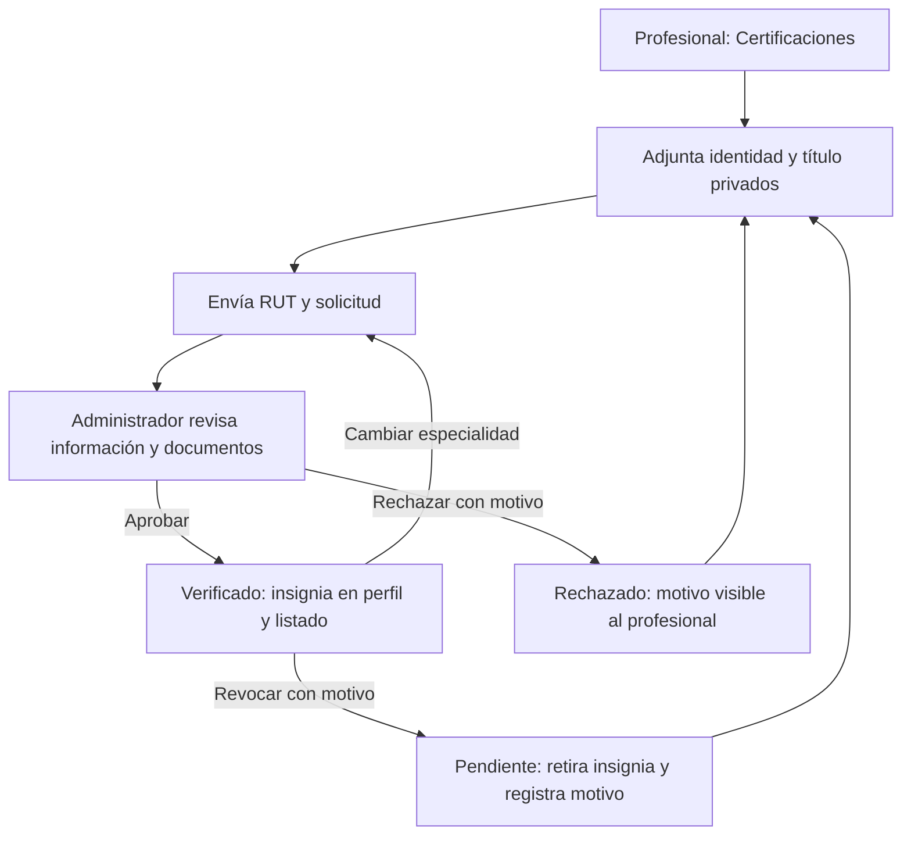

# Panel del administrador

Implementación del 10-10-2026, rama `codex/panel-administrador`. Rodri autorizó Dashboard, Profesionales, Verificaciones, Usuarios y Reportes, usando su mockup como referencia; quedan fuera Configuración y Contenido. Delegó la definición de las reglas de documentos, rechazo y desactivación. El mockup está en `Mockups del Product Owner/mockup_administrador_10-10-2026.jpg`.

## Funciones y reglas

- El administrador entra a `/admin/dashboard`, con navegación propia, menú móvil y cierre de sesión.
- Dashboard y reportes consultan registros reales de los últimos 7, 30 o 90 días, con gráfico, tabla y filtros General/Usuarios/Profesionales. El período usa UTC; los totales son el estado actual y los roles son los actuales de las cuentas. No hay fuente de cobros ni contactos en FitSearch: esos indicadores del mockup no se presentan como cifras reales.
- Profesionales y verificaciones tienen búsqueda, paginación y filtros Pendientes/Verificados/Rechazados. Una ficha pendiente puede estar todavía sin documentos; su aprobación se bloquea hasta completar los requisitos.
- El detalle administrativo tiene Información, Documentos e Historial. Requiere RUT con dígito verificador válido, documento de identidad y título profesional para aprobar. Teléfono y certificado de antecedentes son opcionales. No se consulta un registro externo de títulos: el administrador debe comprobar el contenido.
- Rechazar o revocar requiere un motivo de 5 a 500 caracteres. El profesional ve el motivo en Certificaciones, puede adjuntar la corrección y reenviar la solicitud. La revocación retira inmediatamente la insignia. Cada decisión registra acción, fecha y administrador en el historial.
- Cambiar la especialidad de una ficha verificada retira la insignia y devuelve la ficha a pendiente. Cualquier edición o documento incrementa la revisión: una decisión tomada sobre una versión anterior recibe 409 y exige revisar la ficha actualizada.
- En Usuarios se puede buscar y filtrar por rol o estado, desactivar y reactivar con confirmación. Desactivar conserva los datos, bloquea el inicio de sesión y la siguiente petición de sesiones abiertas. Reactivar exige una sesión nueva: los tokens anteriores continúan inválidos. Las cuentas administrativas no se desactivan desde el panel.
- Los profesionales desactivados quedan fuera del directorio público; el administrador conserva acceso a su ficha. No se puede aprobar una cuenta desactivada.

## Documentos privados

Acepto PDF, JPG y PNG de hasta 5 MB, con comprobación de firma del formato y un máximo de 20 archivos por ficha. Conservo las versiones adjuntadas para la revisión. Los archivos se almacenan con nombres UUID, fuera de las carpetas públicas y de Git; MySQL guarda sus metadatos. No se publican rutas internas.

Solo el propietario profesional y el administrador pueden descargar un documento, con sesión vigente. Se descarga como archivo adjunto, con `nosniff` y sin caché compartida. Esta validación de formato no sustituye un antivirus ni acredita el documento: la revisión administrativa es manual. La aplicación no incluye análisis antivirus ni correo automático de rechazo; el estado y motivo se consultan dentro del perfil.

En un despliegue, `VERIFICATION_STORAGE_DIR` debe apuntar a un directorio persistente de acceso restringido. Hay que respaldarlo junto con MySQL y configurar HTTPS. No conviene almacenar documentos reales en una instancia temporal. El borrado de cuentas y la política institucional de conservación no forman parte de esta entrega; no se borra documentación desde el panel.

## Instalación y cuenta administrativa

Desde la carpeta backend, después de traer la rama:

```powershell
npm run db:generate
npm run db:migrate
npm run db:seed
npm run dev
```

Si Prisma no puede sustituir su DLL en Windows, detener primero la API y volver a ejecutar `db:generate`. La migración `20261010203000_panel_administrativo` añade campos y una tabla; mantiene los datos y las verificaciones anteriores. El esquema pasa de 9 a 10 tablas de dominio implementadas.

Para preparar un administrador, el responsable de la base registra una cuenta independiente y ejecuta localmente, con su correo real:

```powershell
npm run admin:promover -- --correo correo-de-la-cuenta --confirmar
```

La herramienta exige una cuenta existente y activa, rechaza convertir una cuenta profesional y revoca sus sesiones anteriores. No pide ni imprime la contraseña. La asignación administrativa no se expone por registro público ni por la API. Después hay que iniciar sesión de nuevo.

## Contrato y arquitectura

Uso el Prisma compartido de `models/prisma.js`. Las rutas administrativas requieren rol `administrador`; la carga y solicitud requieren `profesional`. La sesión se contrasta en cada petición con `usuarios.activo` y `usuarios.version_sesion`.

| Ruta | Uso |
| --- | --- |
| GET `/api/administrador/resumen` | Totales y registros agrupados; días 7/30/90 |
| GET `/api/administrador/usuarios` | Búsqueda, rol, estado de cuenta y paginación |
| PATCH `/api/administrador/usuarios/:id/estado` | Activar/desactivar; cuerpo `activo` booleano |
| GET `/api/administrador/profesionales` | Búsqueda, estado y paginación |
| GET `/api/administrador/profesionales/:id` | Ficha, documentos e historial |
| POST `/api/administrador/profesionales/:id/decision` | Aprobar/rechazar/revocar; revisión y motivo |
| GET/POST `/api/verificaciones/mi-solicitud` | Consultar y reenviar la solicitud propia |
| POST `/api/verificaciones/documentos` | Archivo binario; tipo y nombre en query |
| GET `/api/verificaciones/documentos/:id` | Descarga privada autenticada |
| PATCH `/api/profesionales/:id/verificar` | Compatibilidad con el PR #15; aplica los mismos requisitos documentales e historial |

Datos añadidos: `usuarios.activo/version_sesion`; `profesionales.estado_verificacion/motivo_rechazo/historial_verificacion/revision_verificacion/rut/telefono`; tabla `documentos_profesionales` relacionada con la ficha. La respuesta de aprobación conserva `{ id, verificado }`.



## Validación y seguimiento

- Backend: 202 pruebas en 25 suites aprobadas.
- Frontend: 152 pruebas en 21 archivos aprobadas.
- Lint en ambas capas y build frontend correctos.
- MySQL local: 17 comprobaciones del flujo con cuentas y archivos temporales, eliminados al terminar. Cubrí documentos, permisos de descarga, rechazo/reenvío/aprobación, revisión obsoleta, desactivación, reactivación y protección del administrador.
- Edge: cinco vistas en escritorio de 1440 px y móvil de 390 px, menú y aprobación con API simulada; sin errores de JavaScript ni desbordamiento horizontal. Estas capturas no son evidencia de datos de producción.
- Encabezado al desplazarse: corregí su posición para conservar el logo y el acceso al menú. Comprobé un desplazamiento de 650 px en escritorio (1440 × 720) y móvil (390 × 844): encabezado a 0 px, barra lateral a 78 px, sin desbordamiento ni errores de JavaScript. El menú móvil abre y cierra con el botón y Escape. Lint y build frontend correctos después del ajuste.
- Certificaciones: el formulario muestra el detalle de validación recibido de la API (por ejemplo, RUT sin guion o dígito verificador incorrecto), conserva los datos para corregirlos y distingue archivos seleccionados de documentos adjuntados. Tres pruebas del componente aprobadas, incluidas corrección/reenvío después de un error y selección sin subida automática; lint y build correctos.
- Mejora del formulario: sustituí el selector de tipo por tres bloques independientes (identidad y título obligatorios; antecedentes opcionales), con archivo, botón y estado de adjunto propios. El RUT se formatea al perder el foco y antes de enviar: elimina puntos y espacios, agrega el guion antes del último carácter y convierte K a mayúscula, conservando la validación de la API. Siete pruebas del componente aprobadas; revisión en Edge a 390 y 1440 px, incluidas subida con botón, conservación del otro archivo y formato del RUT, sin desbordamiento ni errores de JavaScript. Lint y build correctos.

El panel está en el PR #17, apilado sobre el #16, y sigue pendiente de revisión y aceptación de Rodri. El DAS 1.18 incorpora esta ampliación y los diagramas 01–04, 07, 08 y nuevo 11; los marcos anteriores y la documentación del DAS 1.17 se conservan como historial. Los enlaces vigentes están en Exportaciones_Miro.md. La planificación del Product Backlog conserva Sprint 5, prioridad baja y 3 puntos: la autorización de implementar no cambia por sí sola la planificación del equipo.
